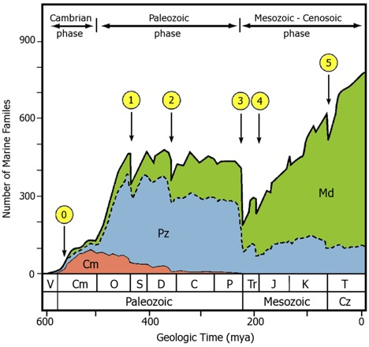
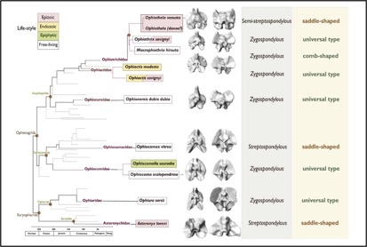
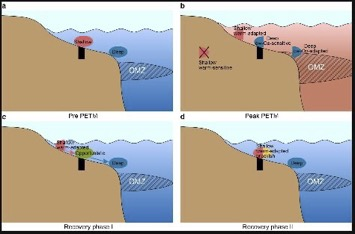
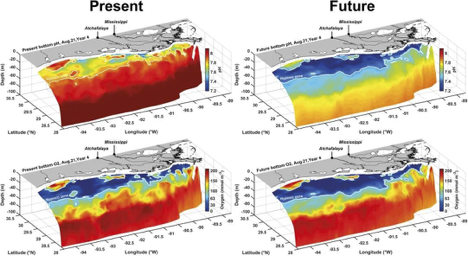

```{r metadata, echo=FALSE}
# creating HTML metadata to accompany the slides
# metathis package documentation: https://pkg.garrickadenbuie.com/metathis/

library(metathis)
meta() %>%
  meta_general(
    description = "Communicating Science Through Meaningful Alt-Text",
    generator = "xaringan and remark.js"
  ) %>% 
  # GitHub repo housing the slides for the talk
  meta_name("github-repo" = "LizHareDogs/TimeScavengersWorkshopAltText") %>%
  # metadata for the social card that appears when you share the link on social media
  meta_social(
    title = "2022 TimeScavengers Workshop | Liz Hare, PhD",
    url = "https://lizharedogs.github.io/TimeScavengersWorkshopAltText/index.html",
    image = "coverImageSlide.png",
    image_alt = "",
    og_type = "website",
    og_author = "Liz Hare",
    twitter_card_type = "summary_large_image",
    twitter_creator = "@DogGeneticsLLC"
  )
```

```{r xaringanthemer, echo=FALSE, warning=FALSE}
library(xaringanthemer)

# creating a custom CSS stylesheet using xaringanthemer
# xaringanthemer package documentation: https://pkg.garrickadenbuie.com/xaringanthemer/reference/style_duo_accent_inverse.html

style_duo_accent_inverse(
  primary_color = "#C6B78A",   # gold color from the logo (headers, inverse slides)
  secondary_color = "#C6B78A", # gold color (links and bold words)
  white_color = "#F5F5F5", # off-white color (text)
  black_color = "#14213D", # dark navy blue color (slide background)
  base_font_size = "25px",
  header_h1_font_size = "2.75rem",
  header_h2_font_size = "2.25rem",
  header_h3_font_size = "1.75rem",
  link_decoration = "underline",
  table_row_even_background_color = "#313C54", # lighter navy color
  inverse_link_color = "#14213D", # dark navy blue color
  code_highlight_color = "#ECECCE", # beige color
  header_background_content_padding_top = "5rem",
  footnote_position_bottom = "40px",
  outfile = "css/xaringan-themer.css",
  text_font_family = "Atkinson Hyperlegible",
  text_font_google = google_font("Atkinson Hyperlegible"),
  header_font_google = google_font("Atkinson Hyperlegible"),
  extra_css = list(
    # the following css styles the horizontal bars
    "hr" = list("color" = "#C6B78A",
                "content" = "''",
                "display" = "block",
                "border" = "none",
                "background-color" = "#C6B78A",
                "height" = "0.08em"),
    # the following css styles the list markers to apply the primary color
    "li::marker" = list("content" = "&#8226;",
                        "color" = "#C6B78A"))
)
```

```{r xaringanExtra, echo=FALSE, warning=FALSE}
library(xaringanExtra)

# specifying xaringanExtra features
# xaringanExtra package documentation: https://pkg.garrickadenbuie.com/xaringanExtra/#/?id=xaringanextra

xaringanExtra::use_xaringan_extra(
  c("tile_view",   # enables an overview of the slide deck using letter "O"
    "slide_tone"   # enables audible tone for slide transitions
    )
  ) 
```


```{r setup, include=FALSE, eval = TRUE}
# loading libraries
library(fontawesome)    # icons for use alongside contact info

# turning off scientific notation
options(scipen = 999)

# setting knitr code chunk options
knitr::opts_chunk$set(collapse = TRUE,
                      fig.retina = 3,
                      cache = FALSE,
                      warning = FALSE,
                      message = FALSE,
                      echo = FALSE,
                      comment = NA,
                      dpi = 300,
                      fig.align = "center")
```


```{r data-import}
## lemurs <- readRDS("data/lemurs.rds")
```

class: bottom, title
background-image: url(img/ben2.jpg)
background-position: 95% 10%
background-size: 200px

<!-- this slide has the Dog Genetics, LLC logo in the top right corner, added using the "background" image classes above. The text begins on the bottom left corner of the slide -->

# `r rmarkdown::metadata$title`
#### `r rmarkdown::metadata$subtitle`
### `r rmarkdown::metadata$author`<br>@DogGeneticsLLC `r fa("twitter", a11y="sem")`

---
class: middle, center


## `r rmarkdown::metadata$author` 

[`r fa("link", a11y="sem")` doggenetics.com](http://doggenetics.com/)<br>
[`r fa("twitter", a11y="sem")` @DogGeneticsLLC](https://twitter.com/DogGeneticsLLC)<br>
[`r fa("github", a11y="sem")` @LizHareDogs](https://github.com/LizHareDogs)<br>
[`r fa("envelope", a11y="sem")` LizHare@DogGenetics.com](mailto:LizHare@DogGenetics.com)


.pull-left[


] <!--end of pull left -->

---

# Today's Topics

- What is alt-text?
- Alt-text for Photos
- Alt-text for Graphs
- Alt-text for other data Visualizations
- Other aspects of accessibility (#a11y)

---

# Alt-text: What It Is

- Attached to images to provide a description for people who use screen reading software.
- Required to adhere to accessibility laws
- Crucial to make sure your science communication reaches everyone  

There are blind, low vision, and neurodivergent people in the general population, 
and there are blind scientists, even though we have not been visible.
---

# Alt-text: What It Does

Answers "Why was this image included?"

Examples: 
- It shows the relationship between X and Y in a graph
- It shows what a plant looks like
- It shows COVID-19 incidences on a map


---


# Alt-Text: What It Isn't

- **Automatically generated** by AI or text mining
- The title
- The caption
- Axis labels on a graph
- A humorous remark

These will usually not answer these questions:  
- "Why am I including this data visualization?"
- "What are the data saying?"

.footnote[
Humor is allowed, but it shouldn't obscure the message conveyed by the image
]
---

# Where is alt-text?


Started in [HTML code](https://en.wikipedia.org/wiki/Alt_attribute).  

Now appears in places like:  
- [MS Office](https://support.microsoft.com/en-us/office/add-alternative-text-to-a-shape-picture-chart-smartart-graphic-or-other-object-44989b2a-903c-4d9a-b742-6a75b451c669)
- PDFs created with Office
- [PDFs created with Adobe Acrobat](https://csuf.screenstepslive.com/s/12867/m/96806/l/1474315-alt-text-for-images-in-adobe-acrobat-pdf)
- [Twitter posts](https://help.twitter.com/en/using-twitter/picture-descriptions)  
- [Facebook posts](https://www.perkinselearning.org/technology/blog/how-add-alt-text-facebook-page)  
- R markdown [documents](https://bookdown.org/yihui/rmarkdown/) and [slides](https://hugo-academic--silvia.netlify.app/2021-03-16-deploying-xaringan-slides/)

.footnote[
Follow links for instructions
]

---

# Missing Alt-Text Infrastructure?  


.pull-left[
Places without alt-text infrastructure  

- academic journals
- books
- magazines  
- software that helps you create websites and blogs
]

.pull-right[
Workarounds  

- Provide descriptions in text, e.g. describe graphed relationship in Results section of a paper.
- Provide text descriptions of images as supplementary material when submitting to an academic journal.
- Use replies or comments in social media if you've forgotten alt-text
- Provide tables and/or raw data for data visualizations
]

---

# Alt-Text: How Long Is It?

*It depends!*  
- context  
- complexity  

Dr. Sheffield's examples in this presentation are too long by many standards, but they are perfect to convey the meanings of the images!

Use your judgement even though
- Some media have character limits for alt-text
- Too many guidelines emphasize brevity
- One or two sentences won't be enough for many data visualizations

---

# Alt-Text for Photos

- Context
- Perspective
- Foreground object(s)?
    - Shape
	- Color
    - Activity
	    - Expression

Dr. Sheffield's dog alt-texts sound like:  

"A cream colored dog with a brown ear snuggles under a blanket. Her tongue is sticking out slightly."

Can you see why this is so much better than "My dog is adorable?"

---

# Context/Perspective Example 1

Alt-text iteration 1:  

"A yellow dog with dark eyebrows and muzzle (possibly a German Shepherd?) edges peers down through a crack between rough splintery slats (possibly a produce crate or pallet?) Most visible are the dark nostrils of the snout, and the brown eyes behind.

---

# Context/Perspective Example 1

.pull-left[
Alt-text iteration 2:

A yellow dog with dark eyebrows and muzzle edges peers down at the camera from above, through a crack between rough splintery slats (possibly a produce crate or pallet?) Most visible are the dark nostrils of the snout, and the brown eyes behind. Sunlight slants in across the dark slats at a steep angle. The ends of more pieces of wood are visible behind the dog. (Is this a SAR scenario?)
]

.pull-right[
``` {r, pointyFind, fig.alt="A yellow dog with dark eyebrows and muzzle edges peers down at the camera from above, through a crack between rough splintery slats (possibly a produce crate or pallet?) Most visible are the dark nostrils of the snout, and the brown eyes behind. Sunlight slants in across the dark slats at a steep angle. The ends of more pieces of wood are visible behind the dog. (Is this a SAR scenario?)", out.width="90%"}

```
.footnote[
Photo from Tracy Darling, Penn Vet Working Dog Center
]

]

---


# Alt-Text For Data Visualization

Ingredients:
1. What kind of visualization is it (line graph, scatter plot, bar chart...?)
2. What variables are on the axes?
3. What is the range of the data?
4. What relationship between variables does the data visualization show?

Opinion: Don't waste my time with 1-3 if you aren't going to include 4. While some automatic
alt-text processes mine some of this information (e.g. R's ggplot2), I don't want to spend time with the metadata if I can't find out what the graph says.


---

# Link to the Data

Providing a link to the data set and/or an HTML-formatted data table allows the user to explore the data on their own.

Examples:
- COVID-19 incidence map by zip code with a table where the user can look up incidence by zip code
- A line graph accompanied by a data set allows the user to explore statistics like mean, median,
minimum, maximum, slope

---

# Data Visualization Example 1

Dr. Sheffield covering all the ingredients!   

.pull-left[
A graph marking diversity through time.  

X axis: geologic time   

y axis: number of marine families.   

The x axis spans from the Ediacaran to the Tertiary with the periods marked. Eons marked below. The Cambrian phase is marked, ending in Cambrian. Paleozoic phase stretches from Ordovician to Permian. Mesozoic- Cenozoic phase stretches from Triassic to Tertiary.   
]

.pull-right[
Diversity starts low- first big jump occuurs in Cambrian but a larger one occurs during Ordovician. The highest point in the Paleozoic reaches in Ordovician and stays there, except for the 2 major extinctions marked. At the Permian- Triassic, there is a large decrease, and it increases steadily to the end of the graph, except for extinction events.    

Each of the major mass extinctions are marked (5). 0 is marked as an extinction of Ediacaran biota (but there is no decrease in diversity- this is hypothesized, but not clear what occured). 
1: extinction at end of Ordovician. 2: Devonian extinction. 3: Permian extinction. 4: Triassic. 5: Cretaceous.   
]

---

# Data Visualization Example 1 Graph

```{r, diversityTime, fig.alt="A graph marking diversity through time. X axis: geologic time. y axis: number of marine families. The x asix spans from the Ediacaran to the Tertiary with the periods marked. Eons marked below. The Cambrian phase is marked, ending in Cambrian. Paleozoic phase stretches from Ordovician to Permian. Mesozoic- Cenozoic phase stretches from Triassic to Tertiary. Diversity starts low- first big jump occuurs in Cambrian but a larger one occurs during Ordovician. The highest point in the Paleozoic reaches in Ordovician and stays there, except for the 2 major extinctions marked. At the Permian- Triassic, there is a large decrease, and it increases steadily to the end of the graph, except for extinction events.  Each of the major mass extinctions are marked (5). 0 is marked as an extinction of Ediacaran biota (but there is no decrease in diversity- this is hypothesized, but not clear what occured). 1: extinction at end of Ordovician. 2: Devonian extinction. 3: Permian extinction. 4: Triassic. 5: Cretaceous.", out.width="50%"}

```

.footnote[
Sepkoski, J. J. (1978). A kinetic model of Phanerozoic taxonomic diversity I. Analysis of marine orders. Paleobiology, 4(3), 223-251.
]

---

# Data Visualization Example 2: Phylogenetic Tree

```{r, phylogenetic, fig.alt = "A phynlogenetic tree of the brittle stars, mapped with the shape of their arms and their life-style, too. The lifestyles are: epizoic (epi), endozoic (endo, epiphytic (epi-p), and free living (free). The shapes of the arm are: saddle- shaped, universal type, or comb-shaped. Neither the life styles or the arm shapes are phylogenetically controlled- meaning, the shapes or life styles are limited to a specific group.  Many of the tips of the trees are not labeled with species names.  The tree relationships are:  Everything belongs to the Ophintegrida or Euryophiurida  Ophintegrida breaks into Amphilipidelia and Ophiomenitida as sister group (meaning, they are most closely related to one another on this tree).  Within Amphilipidelia:  All four taxa are contained within broader grouping of Ophiotrichidae.  Ophiothela venusta (saddle-shaped) and Ophiothela (danae?) (universal type) share a sister group (both epi). Sister to this grouping is Ophiothrix savignyi (free/ epi and universal type) and Macrophiothrix hirsuta (free and comb shape)- these two share a sister relationship.  Within Ophiomenitida: The two named clades that share a sister relationship are Ophiocomidae and Ophiocamacidae. Within Ophiocomidae, there is one species, Ophioxamax vitrea (free, saddle shape). Within  Ophiocomidae, there are two that share a sister relationship:  Ophiocoma scolopendrina (free, universal) and Ophiocomella sexradia (epi-p, universal type). Ophiotrichidae shares a sister group with Ophiactidae. Within this group, two taxa appear- Ophioctis modesta (end, comb- shape) and Ophiactis savignyi (endo, epic, universal). Euryophiurida splits into Ophuirida and Eurypalida. Ophuirida contains one named group, the Ophiuridae that contains Ophiura sarsii (free, universal). Eurypalida also contains one named group, Asteromychidae that contains Asteronyx loveni (epi, saddle).", out.width="60%"} 

```

.footnote[
Goharimanesh M, Ghassemzadeh F, De Kegel B, Van Hoorebeke L, Stöhr S, Mirshamsi O, Adriaens D. The evolutionary relationship between arm vertebrae shape and ecological lifestyle in brittle stars (Echinodermata: Ophiuroidea). Journal of anatomy. 2021 Dec 12.
]

---

# Data Visualization Example 2: Phylogenetic Tree

## Strategy

- Learn the vocabulary used in this kind of research (tree, branch, leaf, node)
- List categories of data (lifestyle and arm shapes)
    - Amount of information depends on whether terms are defined in accompanying text
- Work from most general to most specific
    - this provides context that is useful for comprehension
	
---
	
	# Data Visualization Example 2: Phylogenetic Tree
	
	Dr. Sheffield's alt-text

.pull-left[
A phylogenetic tree of the brittle stars, mapped with the shape of their arms and their life-style, too.   

The lifestyles are: epizoic (epi), endozoic (endo, epiphytic (epi-p), and free living (free). The shapes of the arm are: saddle- shaped, universal type, or comb-shaped.   

Neither the life styles or the arm shapes are phylogenetically controlled- meaning, the shapes or life styles are limited to a specific group.     

Many of the tips of the trees are not labeled with species names. 

The tree relationships are:   

Everything belongs to the Ophintegrida or Euryophiurida 
]

.pull-right[
Ophintegrida breaks into Amphilipidelia and 
Ophiomenitida as sister group (meaning, they are most closely related to one another on this tree).  

Within Amphilipidelia: 
All four taxa are contained within broader grouping of Ophiotrichidae. 
Ophiothela venusta (saddle-shaped) and Ophiothela (danae?) (universal type) share a sister group (both epi). Sister to this grouping is Ophiothrix savignyi (free/ epi and universal type) and Macrophiothrix hirsuta (free and comb shape)- these two share a sister relationship. 

Within Ophiomenitida: The two named clades that share a sister relationship are Ophiocomidae and Ophiocamacidae. Within Ophiocomidae, there is one species, Ophioxamax vitrea (free, saddle shape). Within  Ophiocomidae, there are two that share a sister relationship:  Ophiocoma scolopendrina (free, universal) and Ophiocomella sexradia (epi-p, universal type).   

Ophiotrichidae shares a sister group with Ophiactidae. Within this group, two taxa appear- Ophioctis modesta (end, comb- shape) and Ophiactis savignyi (endo, epic, universal).   


Euryophiurida splits into Ophuirida and Eurypalida. Ophuirida contains one named group, the Ophiuridae that contains Ophiura sarsii (free, universal). Eurypalida also contains one named group, Asteromychidae that contains Asteronyx loveni (epi, saddle). 
s
]


---

# Level Up! Other Kinds of Data Visualizations

## Diagrams and Infographics

These are more challenging to describe

- Provide general context
    - What kind of information?
	- Is it a display of data, a process, etc?
- Processes like flow charts can use a similar strategy to phylogenetic trees
- Is the image subdivided (see next slide with sections a-d)

---

# Diagram/Infographic 1

.pull-left[
Dr. Sheffield's Alt-Text:  

a)	Top left, Pre-PETM setting: regular oceanic conditions for marine life above the oxygen minimum zone (OMZ).  

b)	Top right, During peak PETM: shallow marine migrating upslope for survival. Deep low oxygen species also moving upslope and separating from their fellow deep marine species that are adapted to low oxygen.  

c)	Bottom left, Recovery phase I: Species that survived the PETM returning to pre-event locale above OMZ.  

d)	Bottom Right, Recovery phase II: Mixing of potentially new warm adapted species and shallow marine species. 
]

.pull-right[


``` {r, oceanicConditiomnns, fig.alt="a)	Top left, Pre-PETM setting: regular oceanic conditions for marine life above the oxygen minimum zone (OMZ). b)	Top right, During peak PETM: shallow marine migrating upslope for survival. Deep low oxygen species also moving upslope and separating from their fellow deep marine species that are adapted to low oxygen. c)	Bottom left, Recovery phase I: Species that survived the PETM returning to pre-event locale above OMZ. d)	Bottom Right, Recovery phase II: Mixing of potentially new warm adapted species and shallow marine species.", out.width="90%"}

```

.footnote[
Tian SY, Yasuhara M, Huang HH, Condamine FL, Robinson MM. Shallow marine ecosystem collapse and recovery during the Paleocene-Eocene Thermal Maximum. Global and Planetary Change. 2021 Dec 1;207:103649.

]

]

---

# Diagram/Infographic 2

.pull-left[
**Dr. Sheffield's alt-text:**  

Gulf of Mexico ocean anoxia models. Four models (present on left, future on right) that show modeling results. Model has a number of variables (depth in m, 0 to -100; ph ranging from 7.2-8; latitude ranging from 30.5- 28; longitude ranging from -94 to -89; oxygen from 0-200 mmol m^3).   

Between present and future, models show that pH in oceans and oxygen levels in ocean will be changing- the zones of oxygenation will change, too.  

]

.pull-right[
**Question:**  

Changing how?

``` {r, gulfOfMexico, fig.alt="Gulf of Mexico ocean anoxia models. Four models (present on left, future on right) that show modeling results. Model has a number of variables (depth in m, 0 to -100; ph ranging from 7.2-8; latitude ranging from 30.5- 28; longitude ranging from -94 to -89; oxygen from 0-200 mmol m^3).  Between present and future, models show that pH in oceans and oxygen levels in ocean will be changing- the zones of oxygenation will change, too.", out.width="90%"}

```

.footnote[
Laurent, A., Fennel, K., Ko, D. S., & Lehrter, J. (2018). Climate change projected to exacerbate impacts of coastal eutrophication in the northern Gulf of Mexico. Journal of Geophysical Research: Oceans, 123(5), 3408–3426.

]

]


---

# Objectivity

Report what you perceive about the data without judgement about what they mean.

Don't   
- make assumption about whether values are "good" or "bad" (Jung et al, 2021)  
- express opinions about variables (Jung et al, 2021; Lundgard et al, 2021)
- judge whether a change is small or large (Jung et al, 2021)
- conflate correlation with causation

.footnote[
Jung C, Mehta S, Kulkarni A, Zhao Y, Kim YS. Communicating Visualizations without Visuals: Investigation of Visualization Alternative Text for People with Visual Impairments. IEEE Transactions on Visualization and Computer Graphics. 2021 Sep 30;28(1):1095-105.

Lundgard A, Satyanarayan A. Accessible Visualization via Natural Language Descriptions: A Four-Level Model of Semantic Content. IEEE transactions on visualization and computer graphics. 2021 Sep 30;28(1):1073-83.
]

---

# Summary

- Understand your context  
- Tell your reader the meaning the picture or visualization conveys  
    - Ask yourself why you're including the data visualization in your media
- Automatic alt-text is not complete, so write your own or edit


---

# Other Aspects of Accessibility to COnsider

- Use colors that can be distinguished by people with color blindness
([WebAIM Visual Disabilities: Color Blindness](https://webaim.org/articles/visual/colorblind))
- Ensure sufficient contrast and text size ([WebAIM Contrast Checker](https://webaim.org/resources/contrastchecker))
- Flashing, movement can trigger migraines and seizures
([WebAIM Seizure and Vestibular Disorders](https://webaim.org/articles/seizure/))
- Avoid cognitive complexity
([Mozilla Cognitive Accessibility](https://developer.mozilla.org/en-US/docs/Web/Accessibility/Cognitive_accessibility))
- For web sites: ensure that if the image can be navigated (like a map), this can be done with the keyboard and not only with the mouse
([WebAIM Keyboard Accessibility](https://webaim.org/techniques/keyboard/))

---


# Further Reading

Canelón S, Hare E. (2021) Revealing room for improvement in accessibility within a social media data visualization learning community. csvConf2021 https://github.com/spcanelon/csvConf2021  

Jung C, Mehta S, Kulkarni A, Zhao Y, Kim YS. Communicating Visualizations without Visuals: Investigation of Visualization Alternative Text for People with Visual Impairments. IEEE Transactions on Visualization and Computer Graphics. 2021 Sep 30;28(1):1095-105.  

Lundgard A, Satyanarayan A. Accessible Visualization via Natural Language Descriptions: A Four-Level Model of Semantic Content. IEEE transactions on visualization and computer graphics. 2021 Sep 30;28(1):1073-83.
---


class: middle, 

.pull-left[
# Thank you!

Sarah Sheffield for invitation & sample graphics  
Angela Baldo for dog alt-texts  
Silvia Canelón for Xaringan/rmarkdown slide template

] <!--end of pull left -->

.pull-right[
.right[
<!--HTML code inserting a circular avatar of a square photo-->
 -->
<!-- previous line commented out for square logo -->

## `r rmarkdown::metadata$author`

<!--Inserting social media links-->
[`r fa("link", a11y="sem")` doggenetics.com](http://doggenetics.com/)<br>
[`r fa("twitter", a11y="sem")` @DogGeneticsLLC](https://twitter.com/DogGeneticsLLC)<br>
[`r fa("github", a11y="sem")` @LizHareDogs](https://github.com/LizHareDogs)<br>
[`r fa("envelope", a11y="sem")` LizHare@DogGenetics.com](mailto:LizHare@DogGenetics.com)
] <!--end of right -->
] <!--end of pull right -->

???
Thank you for joining me!
You can find my contact information linked on this slide if you want to get in touch, and I'm happy to take any questions.

This slide contains
- `.pull-left[]` and `.pull-right[]` classes
- `.right[]` class
